# **Behavioral Cloning** 
## Kevin Harrilal
## Writeup Template
### You can use this file as a template for your writeup if you want to submit it as a markdown file, but feel free to use some other method and submit a pdf if you prefer.
---
**Behavioral Cloning Project**
The goals / steps of this project are the following:

* Use the simulator to collect data of good driving behavior
* Build, a convolution neural network in Keras that predicts steering angles from images
* Train and validate the model with a training and validation set
* Test that the model successfully drives around track one without leaving the road
* Summarize the results with a written report

[//]: # (Image References)
[image1]: ./examples/placeholder.png "Model Visualization"
[image2]: ./examples/placeholder.png "Grayscaling"
[image3]: ./examples/placeholder_small.png "Recovery Image"
[image4]: ./examples/placeholder_small.png "Recovery Image"
[image5]: ./examples/placeholder_small.png "Recovery Image"
[image6]: ./examples/placeholder_small.png "Normal Image"
[image7]: ./examples/placeholder_small.png "Flipped Image"

# Results

Here is a quick video displaying the final results of the model driving along the track. I had some issues using the save feature built in to drive.py, so this was recorded using screen capture instead, and also shows the live angle and speed output. Higher resolution video can be found in the track1_autonomous.mp4 video contained in the repository.


## Rubric Points
### Here I will consider the [rubric points](https://review.udacity.com/#!/rubrics/432/view) individually and describe how I addressed each point in my implementation.  

---
### Files Submitted & Code Quality
#### 1. Submission includes all required files and can be used to run the simulator in autonomous mode
My project includes the following files:

* network.ipynb containing the script to create and train the model (for all intensive purposes this is model.py) I choose to use a IPYNB because the model was trained using Amazon EC2 and it was easier to remotely interface and debug a Jupyter notebook
* drive.py for driving the car in autonomous mode
* model.h5 containing a trained convolution neural network produced by network.ipynb
* KH_writeup_report.md or writeup_report.pdf summarizing the results

#### 2. Submission includes functional code. Using the Udacity provided simulator and my drive.py file, the car can be driven autonomously around the track by executing 

```
source activate carnd-term1
python drive.py model.h5```

#### 3. Submission code is usable and readable

The network.ipynb file contains the code for training and saving the convolution neural network. The file shows the pipeline I used for training and validating the model, and it contains comments to explain how the code works.

The notebook is written so that it can easily be followed:

The first part loads in the data. The data is a combination of the Udacity data, and two different sets of data that I captured on my own from driving around the track. 

The driving was done on track 1, both forwards and backwards, and using the Udacity recommendation of also capturing a lap of recovery. 

With all datasets combined there were over 70,000 starting pictures in the dataset. 
The dataset includes all three camera angles. And an offset steering angle of 0.2 degrees is used with relation to the center image.

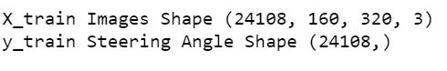

We also look at the histogram of the data in order to view its correlation to the angles captured. In the histogram we can see there are three peaks 1. At 0 degrees, this makes sense because a lot of the time we are driving without any steering correction. 

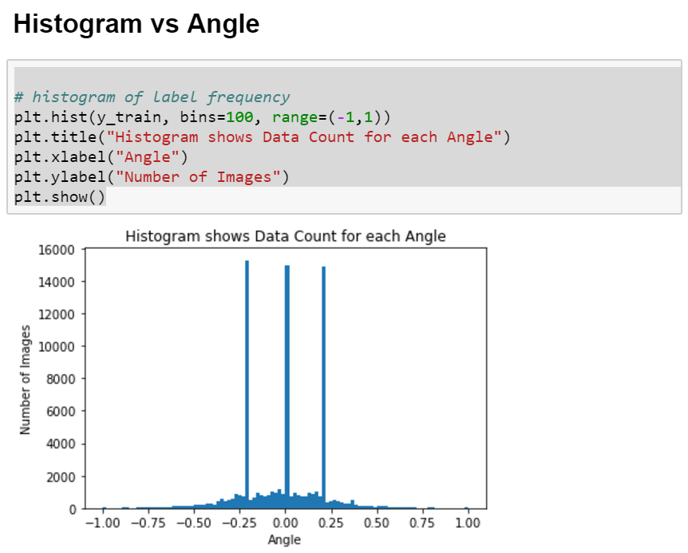

However we want a more even distribution of data or this dataset will cause the model to be biased to these large swings in steering angle. 

To normalize the dataset, we equalize the data but removing excess images so that more angles can have even representation. Using the Histogram from above we see that most angles have at least 500 images. So we chop the data at every angle to no more than 500 images. 

The algorithm divides the angles of the car -1 to +1 into 1000 bins, and determines how many current measurements fall within that range. If the value is over 500 images, the code randomly selects 500 images to keep and discards the rest, if there are less than 500 image for a given meausrement bin, the algorithm keeps all. The point of this is to normalize the data and not have those peaks. The code is in the network.ipynb file but repeated below:

```
bins = 100                 # N of bins
bin_n = 500                 # N of examples to include in each bin (at most)

X_train_norm = []
y_train_norm = []


for low in np.linspace(-1, 1, 2*bins+1):
    idx = (y_train>low)*(y_train<(low+1/bins))
    all_index = np.where(idx)[0]
    #print(all_index)
    if len(all_index) >= bin_n:
        rand = (np.random.choice(all_index, bin_n, replace=False))
        for a in rand:
            X_train_norm.append(X_train[a])
            y_train_norm.append(y_train[a])
        
    elif len(all_index > 0):
        for b in all_index:
            X_train_norm.append(X_train[b])
            y_train_norm.append(y_train[b])
```
The histogram of the new normalized dataset is below:

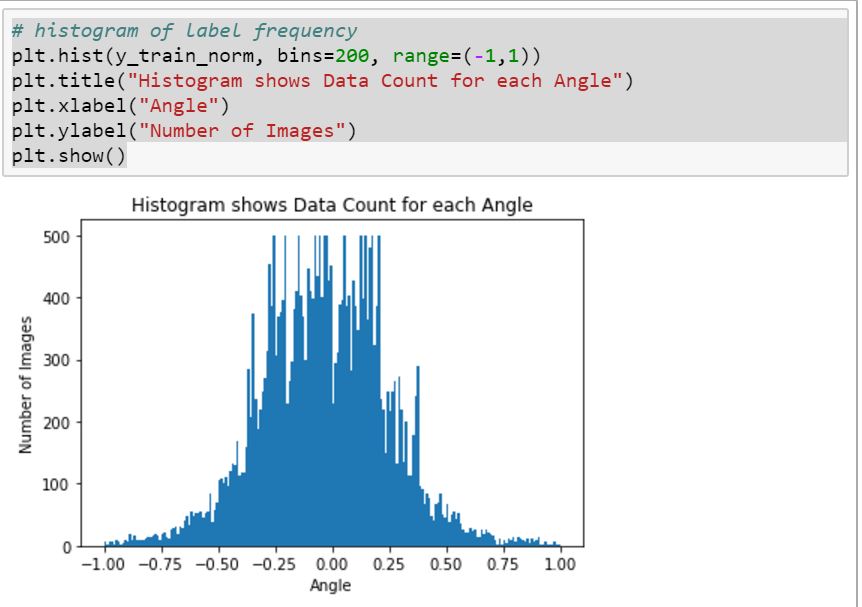

After normalizing the data, the dataset falls to about ~30,000 samples

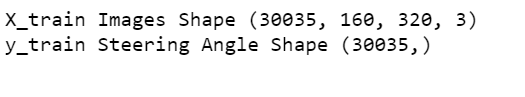

After the data is loaded into the the notebook, it is ran through some pre-processing. The augmentation is a 3 part process:

1. Random Shaowing
2. Flip about X
3. Pixel Normalization
4. Cropping


### Random Shadowing
It was noticed during data capture, the simulator has many shadows on the road. To help the model generalize better, we take the dataset and add random shadows to the images and augment the dataset with additional images with shadows. 

To do this we take an image, randomly select two points at the top and bottom of the image, draw a line connecting the two points and any point to the left of this line we adjust the brightness of the pixels to simulate a shadow. Each randome shadow image is added to the total datset double the data points. 

The code to do this is in Netowkr.ipynb but repeated below:

```
#get shape of image
def randomShadow(image):
    temp_img = np.copy(image)
    h, w = temp_img.shape[0], temp_img.shape[1]

    #Select two points along image width at random
    [x1, x2] = np.random.choice(w, 2, replace=False)

    #find line equation between to points, with both points on axis
    k = h / (x2 - x1)
    b = - k * x1

    #multiply pixel to affect brightness
    for i in range(h):
        c = int((i - b) / k)
        temp_img[i, :c, :] = (temp_img[i, :c, :] * .5).astype(np.int32)

    return temp_img 
```

Here is an example of an image before and after random shadowing:

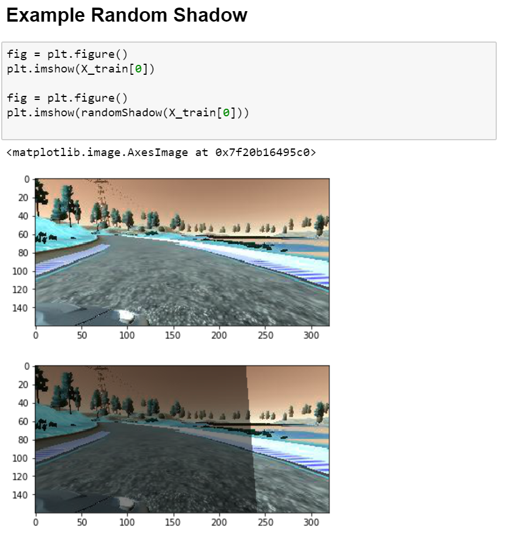

Here is the histogram of our data after shadowing and the dataset has doubled to about ~60,000 data points

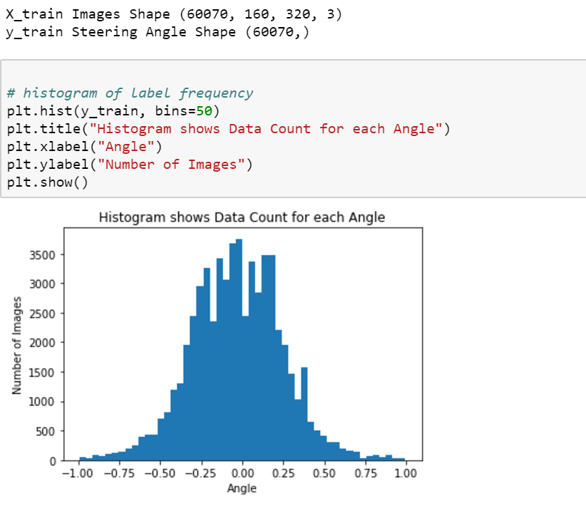

### Flipping about X

The track has mostly left turns, but to help it generalize we did two things, drive the track in reverse to collect more data, and now we flip the images and invert the measurement. This does two things to our data.

1. Helps simulate additional views
2. Inverts the shadowing so shadows also appear on the right side, even through our algorithm only 

We flip every image in our dataset, doubleling our dataset once more, but keeping the distribution nearly normalized.

The code to do the flip is:

```
augmented_images, augmented_measurements = [],[]

for image, measurement in zip(X_train, y_train):
        augmented_images.append(image)
        augmented_measurements.append(measurement)
        augmented_images.append(cv2.flip(image,1))
        augmented_measurements.append(measurement*-1.0)

X_train = np.array(augmented_images)
y_train = np.array(augmented_measurements)
```

An example of a flip is shown below:

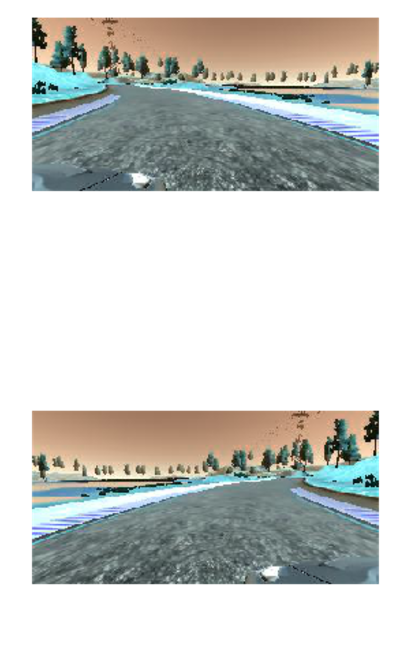

The final dataset size and histogram is:
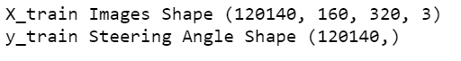
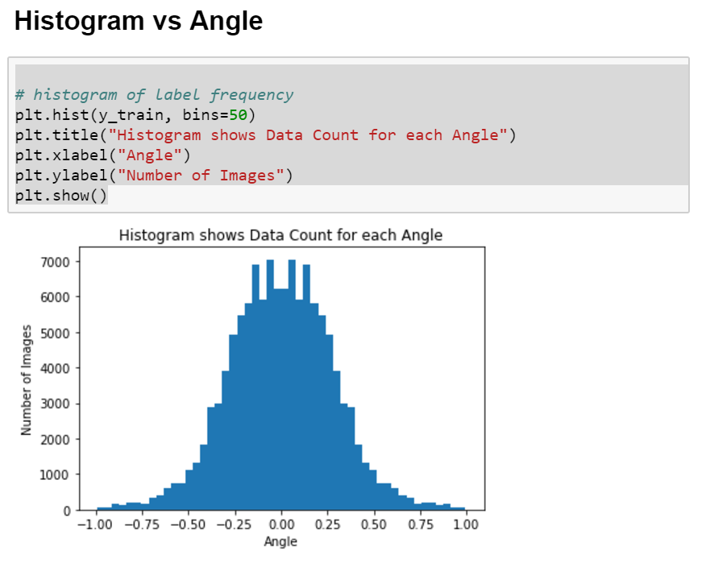


And some images in the final dataset with their measurements:
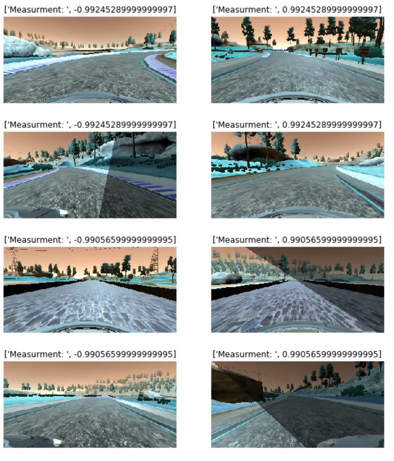

### Pixel Normalization
The first step in the Kera model is to normalize the pixel values and get a zero mean we do this with:
```
model.add(Lambda(lambda x: (x / 255.0) - 0.5, input_shape=(160,320,3)))
```

### Cropping
The last image processing is actually done inside of the model, and effectively crops the top and bottom off the image. The purpose of this layer is to remove the sky and hood form the images so that the network doesn't learn bad features.

as can be see from the Keras layer
```
model.add(Cropping2D(cropping=((50,20), (0,0))))
```

We crop the top 50 pixels and the bottom 20 pixels. 

### Model Architecture and Training Strategy
####1. An appropriate model architecture has been employedThe model architecture made use of the NVIDIA 
The model was largely based on the NVIDIA model. This model was chosen as a starting point because of it's recommendation in class. And it's similar implementation to the LeNEt architecture which we gainedsignificant experience with from the LeNet lab and the traffic sign classifier. 

Here is a high level architecture of the Nvidia model:
The model includes ELU layers to introduce nonlinearity. The model orignally used RELU's but the problem with relu is that it’s mean is not zero. If the mean value of activation is zero you get a faster learning.But if you use just a linear activation function (which would have mean activation zero) your overall network becomes linear and which will effectively be equal to a single layer network and with linear networks there is very little that you can learn from the data, that’s why we use non linear activation functions. Now what ELU does is that it tries to make the mean activation close to zero and as it is an exponential function it does not saturate.

The model is based off the NVIDIA Model which has 5 convolutional layers followed by 4 fully connected layers pictured here:


####2. Attempts to reduce overfitting in the model
I augmented the model to contain a dropout layer betwwen the convolutional layers and the fully connected layers in order to reduce overfitting.

The model was trained and validated on different data sets to ensure that the model was not overfitting. 30% of the datset was used for a training set.The model was tested by running it through the simulator and ensuring that the vehicle could stay on the track.

The final architecture is below:

```
from keras.models import Sequential
from keras.layers import Flatten, Dense, Lambda, Dropout
from keras.layers.convolutional import Convolution2D
from keras.layers import Cropping2D


model = Sequential()
model.add(Lambda(lambda x: (x / 255.0) - 0.5, input_shape=(160,320,3)))
model.add(Cropping2D(cropping=((50,20), (0,0))))
model.add(Convolution2D(24,5,5, subsample=(2,2), activation='elu'))
model.add(Convolution2D(36,5,5, subsample=(2,2), activation='elu'))
model.add(Convolution2D(48,5,5, subsample=(2,2), activation='elu'))
model.add(Convolution2D(64,3,3, activation='elu'))
model.add(Convolution2D(64,3,3, activation='elu'))
model.add(Dropout(0.5))
model.add(Flatten())
model.add(Dense(100))
model.add(Dense(50))
model.add(Dense(10))
model.add(Dense(1))


model.compile(loss='mse', optimizer='adam')
history_object = model.fit(X_train, y_train, validation_split=0.3, shuffle=True, nb_epoch=4)

model.save('model.h5')
```

####3. Model parameter tuning
The model used an adam optimizer, so the learning rate was not tuned manually, as can be seen from the code above. However we did tune two parameters manually. The steering offset for left and right images, and the drop out probability. The final results are:

Steering Angle Offset = 0.2
Dropout Probability = 0.5


####4. Appropriate training data
Training data was used to help keep the vehicle on the road and allow the model to perform behavioral cloning. The data was generated by driving 4 laps in the center of the lane in the correct direction. 2 laps going around the track backwards. And then two laps of revovery where for each left and right recoveries, where the vehicle was allowd to go off courve and then I correct it back to the center.  

There were over 70,000 images, and then as described above the data went through a pre-processing scheme to augment the data better. 
###Model Architecture and Training Strategy
####1. Solution Design Approach

* History of training
1. Started with Udacity provided data only and Nvidia unmodified model. Car did not drive more than afew feet before steering off
2. Recored my own data of about 3 center lane trials. Car made it to the first turn then veered off track. 
3. Added a cropping layer based on the Udacity project videos, this helped a lot
4. Added more data by recording more laps, didnt see much improvement, the car could drive most of the lap but still get hung up in random places, also noticed the model overfitting based on the history plot
5. Implemented a Dropout layer, reduced epochs from 10 to 2. Model drives well, but not around entire track
6. Added Flip and Shadowing. Car drives around track but does heavy correction.
7. Normalized data to be more uniform. Increased Epoch to 4. 
8. Car drives around track satisfactorily. 

At the end of the process, the vehicle is able to drive autonomously around the track without leaving the road.

####2. Final Model Architecture

| Layer         		|     Description	        					| 
|:---------------------:|:---------------------------------------------:| 
| Input         		| 160x320x3 RGB image   							| 
| Cropping              | remove top 50 and bottom 20 pixels            |
| Convolution  5x5x24  	| 2x2 stride, valid padding,	|
| ELU					|												|
| Convolution  5x5x24  	| 2x2 stride, valid padding,	|
| ELU					|												|
| Convolution  5x5x24  	| 2x2 stride, valid padding,	|
| ELU					|												|
| Convolution  5x5x24  	| 2x2 stride, valid padding,	|
| ELU					|												|
| Dropout					|												|
| Flatten |  |
| Fully connected		| output 100  									|
| Fully connected		| output 50   									|
| Fully connected		| output 10									| 
| Fully connected		| outoput 1  									| 

### Final training

The final model training:

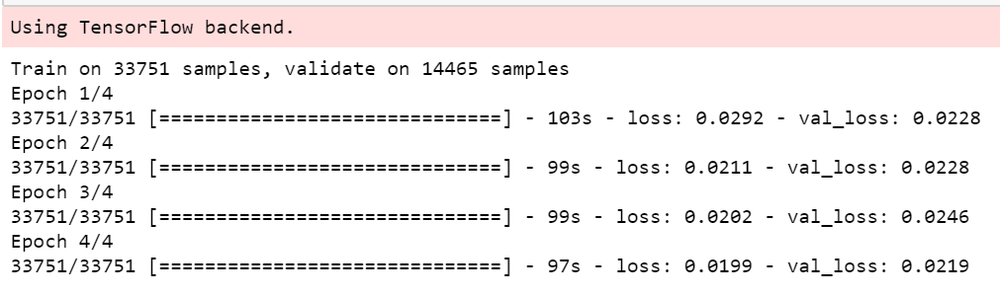

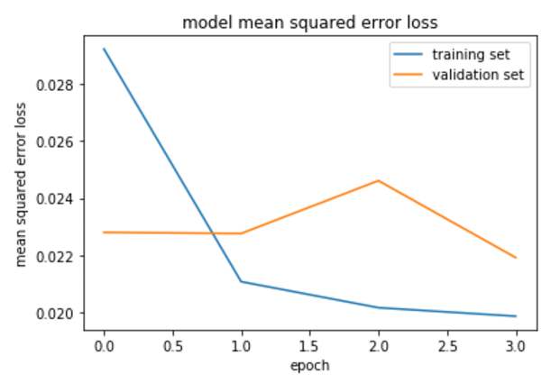


####3. Creation of the Training Set & Training Process
As mentioned above: Training data was used to help keep the vehicle on the road and allow the model to perform behavioral cloning. The data was generated by driving 4 laps in the center of the lane in the correct direction. 2 laps going around the track backwards. And then two laps of revovery where for each left and right recoveries, where the vehicle was allowd to go off courve and then I correct it back to the center.  

There were over 70,000 images, and then as described above the data went through a pre-processing scheme to augment the data better. 


The dataset then went through the pre-processing phase as described above. 
