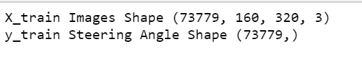
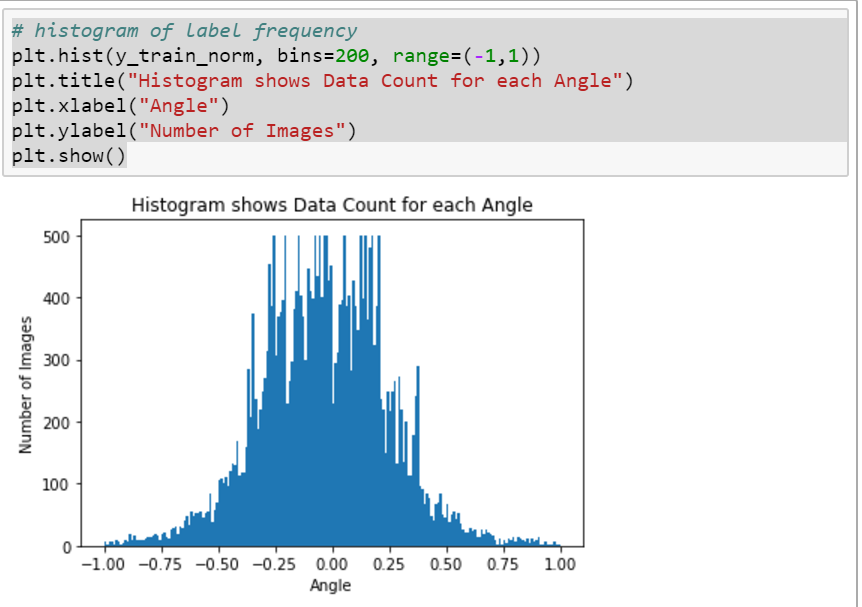
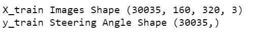
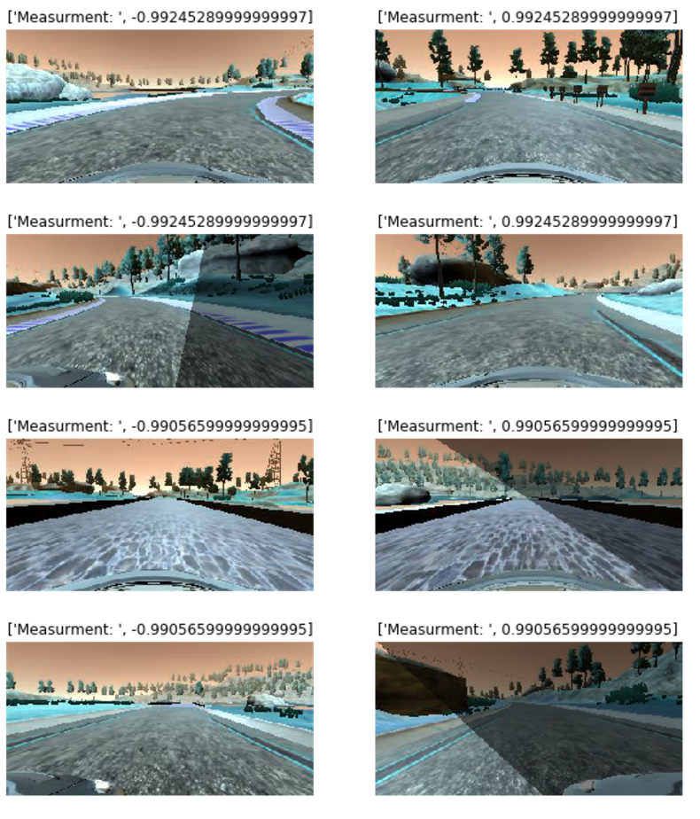

# **Behavioral Cloning** 
## Kevin Harrilal
## Writeup Template
### You can use this file as a template for your writeup if you want to submit it as a markdown file, but feel free to use some other method and submit a pdf if you prefer.
---
**Behavioral Cloning Project**
The goals / steps of this project are the following:

* Use the simulator to collect data of good driving behavior
* Build, a convolution neural network in Keras that predicts steering angles from images
* Train and validate the model with a training and validation set
* Test that the model successfully drives around track one without leaving the road
* Summarize the results with a written report

[//]: # (Image References)
[image1]: ./examples/placeholder.png "Model Visualization"
[image2]: ./examples/placeholder.png "Grayscaling"
[image3]: ./examples/placeholder_small.png "Recovery Image"
[image4]: ./examples/placeholder_small.png "Recovery Image"
[image5]: ./examples/placeholder_small.png "Recovery Image"
[image6]: ./examples/placeholder_small.png "Normal Image"
[image7]: ./examples/placeholder_small.png "Flipped Image"

# Results

Here is a quick video displaying the final results of the model driving along the track. I had some issues using the save feature built in to drive.py, so this was recorded using screen capture instead, and also shows the live angle and speed output. 

[](https://www.youtube.com/watch?v=Uav6DDdNFPs)


06__Keras_Model
08_train_model09_model_history

## Rubric Points
### Here I will consider the [rubric points](https://review.udacity.com/#!/rubrics/432/view) individually and describe how I addressed each point in my implementation.  

---
### Files Submitted & Code Quality
#### 1. Submission includes all required files and can be used to run the simulator in autonomous mode
My project includes the following files:

* network.ipynb containing the script to create and train the model
* drive.py for driving the car in autonomous mode
* model.h5 containing a trained convolution neural network 
* writeup_report.md or writeup_report.pdf summarizing the results

#### 2. Submission includes functional codeUsing the Udacity provided simulator and my drive.py file, the car can be driven autonomously around the track by executing 

```source activate carnd-term1python drive.py model.h5```

#### 3. Submission code is usable and readable

The network.ipynb file contains the code for training and saving the convolution neural network. The file shows the pipeline I used for training and validating the model, and it contains comments to explain how the code works.

The notebook is written so that it can easily be followed:

The first part loads in the data. The data is a combination of the Udacity data, and two different sets of data that I captured on my own from driving around the track. 

The driving was done on track 1, both forwards and backwards, and using the Udacity recommendation of also capturing a lap of recovery. 

With all datasets combined there were over 70,000 starting pictures in the dataset. 
The dataset includes all three camera angles. And an offset steering angle of 0.2 degrees is used with relation to the center image.



We also look at the histogram of the data in order to view its correlation to the angles captured. In the histogram we can see there are three peaks 1. At 0 degrees, this makes sense because a lot of the time we are driving without any steering correction. 


However we want a more even distribution of data or this dataset will cause the model to be biased to these large swings in steering angle. 

To normalize the dataset, we equalize the data but removing excess images so that more angles can have even representation. Using the Histogram from above we see that most angles have at least 500 images. So we chop the data at every angle to no more than 500 images. 

The algorithm divides the angles of the car -1 to +1 into 1000 bins, and determines how many current measurements fall within that range. If the value is over 500 images, the code randomly selects 500 images to keep and discards the rest, if there are less than 500 image for a given meausrement bin, the algorithm keeps all. The point of this is to normalize the data and not have those peaks. The code is in the network.ipynb file but repeated below:

``
bins = 100                 # N of bins
bin_n = 500                 # N of examples to include in each bin (at most)

X_train_norm = []
y_train_norm = []


for low in np.linspace(-1, 1, 2*bins+1):
    idx = (y_train>low)*(y_train<(low+1/bins))
    all_index = np.where(idx)[0]
    #print(all_index)
    if len(all_index) >= bin_n:
        rand = (np.random.choice(all_index, bin_n, replace=False))
        for a in rand:
            X_train_norm.append(X_train[a])
            y_train_norm.append(y_train[a])
        
    elif len(all_index > 0):
        for b in all_index:
            X_train_norm.append(X_train[b])
            y_train_norm.append(y_train[b])
```
The histogram of the new normalized dataset is below:



After normalizing the data, the dataset falls to about ~30,000 samples



After the data is loaded into the the notebook, it is ran through some pre-processing. The augmentation is a 3 part process:

1. Random Shaowing
2. Flip about X
3. Cropping


### Random Shadowing
It was noticed during data capture, the simulator has many shadows on the road. To help the model generalize better, we take the dataset and add random shadows to the images and augment the dataset with additional images with shadows. 

To do this we take an image, randomly select two points at the top and bottom of the image, draw a line connecting the two points and any point to the left of this line we adjust the brightness of the pixels to simulate a shadow. Each randome shadow image is added to the total datset double the data points. 

The code to do this is in Netowkr.ipynb but repeated below:

```
#get shape of image
def randomShadow(image):
    temp_img = np.copy(image)
    h, w = temp_img.shape[0], temp_img.shape[1]

    #Select two points along image width at random
    [x1, x2] = np.random.choice(w, 2, replace=False)

    #find line equation between to points, with both points on axis
    k = h / (x2 - x1)
    b = - k * x1

    #multiply pixel to affect brightness
    for i in range(h):
        c = int((i - b) / k)
        temp_img[i, :c, :] = (temp_img[i, :c, :] * .5).astype(np.int32)

    return temp_img 
```

Here is an example of an image before and after random shadowing:


Here is the histogram of our data after shadowing and the dataset has doubled to about ~60,000 data points


### Flipping about X

The track has mostly left turns, but to help it generalize we did two things, drive the track in reverse to collect more data, and now we flip the images and invert the measurement. This does two things to our data.

1. Helps simulate additional views
2. Inverts the shadowing so shadows also appear on the right side, even through our algorithm only 


the data each frame is flipped about the horizontal axis using openCV and the angle is negated. This acts to double the number of datapoints, and training values used. 

A Histogram of the augmented data is then shown in the notebook. We can see the histogram is similar to the first, however with more datapoints. Essentially the flip operation helps to multiply the data. 

We can see the histogram didn't change much other than the magnitude of each dataset, Which has essentially doublled with all of the flipped images. 
Below are some screen shots of what the images looked like: 

### Model Architecture and Training Strategy
####1. An appropriate model architecture has been employedThe model architecture made use of the NVIDIA 
The model was largely based on the NVIDIA model. This model was chosen as a starting point because of it's recommendation in class. And it's similar implementation to the LeNEt architecture which we gainedsignificant experience with from the LeNet lab and the traffic sign classifier. 
Here is a high level architecture of the Nvidia model:
The model includes ELU layers to introduce nonlinearity. But the problem with relu is that it’s mean is not zero. If the mean value of activation is zero you get a faster learning.But if you use just a linear activation function (which would have mean activation zero) your overall network becomes linear and which will effectively be equal to a single layer network and with linear networks there is very little that you can learn from the data, that’s why we use non linear activation functions. Now what ELU does is that it tries to make the mean activation close to zero and as it is an exponential function it does not saturate(I have not used this activation function yet), you can conclude this from ELU graph.


####2. Attempts to reduce overfitting in the model
The model contains dropout layers in order to reduce overfitting (model.py lines 21). 
The model was trained and validated on different data sets to ensure that the model was not overfitting (code line 10-16). The model was tested by running it through the simulator and ensuring that the vehicle could stay on the track.
####3. Model parameter tuning
The model used an adam optimizer, so the learning rate was not tuned manually (model.py line 25).
####4. Appropriate training data
Training data was chosen to keep the vehicle driving on the road. I used a combination of center lane driving, recovering from the left and right sides of the road ... 
For details about how I created the training data, see the next section. 
###Model Architecture and Training Strategy
####1. Solution Design Approach
The overall strategy for deriving a model architecture was to ...
My first step was to use a convolution neural network model similar to the ... I thought this model might be appropriate because ...
In order to gauge how well the model was working, I split my image and steering angle data into a training and validation set. I found that my first model had a low mean squared error on the training set but a high mean squared error on the validation set. This implied that the model was overfitting. 
To combat the overfitting, I modified the model so that ...
Then I ... 
The final step was to run the simulator to see how well the car was driving around track one. There were a few spots where the vehicle fell off the track... to improve the driving behavior in these cases, I ....
At the end of the process, the vehicle is able to drive autonomously around the track without leaving the road.
####2. Final Model Architecture
The final model architecture (model.py lines 18-24) consisted of a convolution neural network with the following layers and layer sizes ...
Here is a visualization of the architecture (note: visualizing the architecture is optional according to the project rubric)
![alt text][image1]
####3. Creation of the Training Set & Training Process
To capture good driving behavior, I first recorded two laps on track one using center lane driving. Here is an example image of center lane driving:
![alt text][image2]
I then recorded the vehicle recovering from the left side and right sides of the road back to center so that the vehicle would learn to .... These images show what a recovery looks like starting from ... :
![alt text][image3]![alt text][image4]![alt text][image5]
Then I repeated this process on track two in order to get more data points.
To augment the data sat, I also flipped images and angles thinking that this would ... For example, here is an image that has then been flipped:
![alt text][image6]![alt text][image7]
Etc ....
After the collection process, I had X number of data points. I then preprocessed this data by ...
I finally randomly shuffled the data set and put Y% of the data into a validation set. 
I used this training data for training the model. The validation set helped determine if the model was over or under fitting. The ideal number of epochs was Z as evidenced by ... I used an adam optimizer so that manually training the learning rate wasn't necessary.
Help Me
